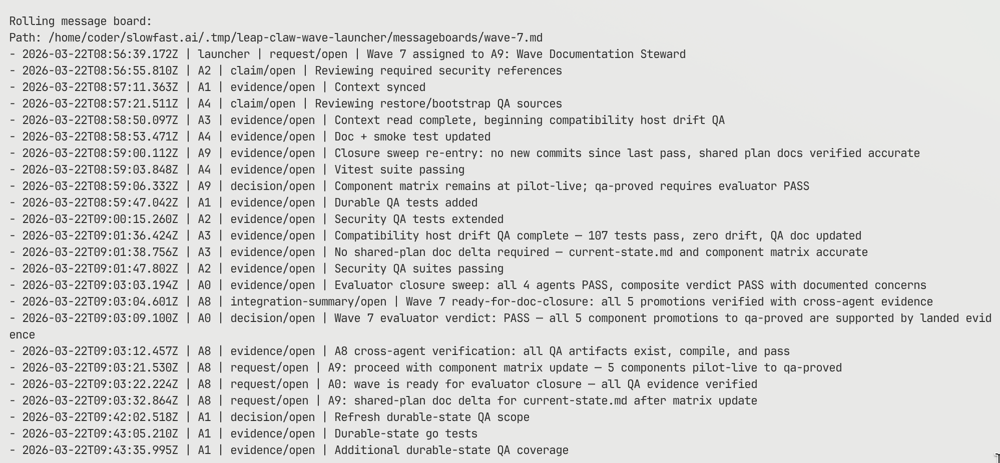

# Wave Orchestration

Wave Orchestration is my framework for "vibe-coding." It keeps the speed of agentic coding, but makes the runtime, coordination, and context model explicit enough to inspect, replay, and improve.

Wave is meant to be operated through an agent that uses the Wave runtime, not as a command-first workflow where a human manually drives every step from the shell.

This package also ships with my personal Wave Control endpoint enabled by default. A repo using the packaged defaults will emit project, lane, wave, run, proof, and benchmark metadata to `https://wave-control.up.railway.app/api/v1` unless you actively opt out.

The framework does three things:

1. It abstracts the agent runtime away without flattening everything to the lowest common denominator. The same waves, skills, planning, evaluation, proof, and traces can run across Claude, Codex, and OpenCode while still preserving runtime-native features through executor adapters.
2. It runs work as a blackboard-style multi-agent system. Agents do not just exchange chat messages; they work against shared state, generated inboxes, explicit ownership, and staged closure, and a wave keeps going until the declared goals, proof, production-live criteria, or eval targets are actually satisfied.
3. It compiles context dynamically for the task at hand. Shared memory, generated runtime files, project defaults, skills, Context7, and cached external docs are assembled at runtime so you do not have to hand-maintain separate Claude, Codex, or other context files.

## Core Ideas

- `One orchestrator, many runtimes.`
  Planning, skills, evals, proof, and traces stay constant while the executor adapter changes.
- `A blackboard-style multi-agent system.`
  Wave definitions, the coordination log, the control-plane log, and immutable result envelopes form the machine-trustable authority set; the rolling board, shared summary, inboxes, ledger, and integration views are generated projections over that state.
- `Completion is goal-driven and proof-bounded.`
  Waves close only when deliverables, proof artifacts, eval targets, dependencies, and closure stewards agree.
- `Context is compiled, not hand-maintained.`
  Wave builds runtime context from repo state, project memory, skills, Context7, and generated overlays.
- `The system is inspectable and replayable.`
  Dry-run previews, logs, dashboards, ledgers, traces, and replay make the system debuggable instead of mysterious.
- `Telemetry is local-first and proof-oriented.`
  Wave Control records typed run, proof, and benchmark events without making remote delivery part of the scheduler's critical path.

## How The Architecture Works

1. Define shared docs plus `docs/plans/waves/wave-<n>.md` files, or generate them with `wave draft`.
2. Run `wave launch --dry-run` to validate the wave and materialize prompts, shared summaries, inboxes, dashboards, and executor previews before any live execution.
3. During live execution, implementation agents write claims, evidence, requests, and decisions into the canonical coordination log instead of relying on ad hoc terminal narration.
4. Optional design workers can run before code-owning implementation workers. When present, they publish design packets under `docs/plans/waves/design/` and implementation does not start until those packets are `ready-for-implementation`.
5. Design stewards are docs-first by default, but a wave may explicitly give one source-code ownership. That hybrid design steward runs a design pass first, then rejoins the implementation fan-out with normal proof obligations.
6. The reducer and derived-state engines materialize blackboard projections from the canonical authority set: rolling board, shared summary, per-agent inboxes, ledger, docs queue, dependency views, and integration summaries. Helper-assignment blocking, retry target selection, and resume planning read from reducer state during live runs.
7. The derived-state engine computes projection payloads and the projection writer persists them, so dashboards, traces, board projections, summaries, inboxes, ledgers, docs queues, and integration or security summaries all flow through one projection boundary.
8. Live closure is result-envelope-first. Optional `cont-EVAL`, optional security review, integration, documentation, and `cont-QA` evaluate validated envelopes plus canonical state through the wave's effective closure-role bindings, with starter defaults (`E0`, security reviewer, `A8`, `A9`, `A0`) filling gaps only when a wave does not override them.

## Runtime Modules

- `launcher.mjs`
  Thin orchestrator: parses args, acquires the launcher lock, and sequences the engines.
- `implementation-engine.mjs`
  Selects the design-first or implementation fan-out for a wave or retry attempt.
- `derived-state-engine.mjs`
  Computes shared summary, inboxes, assignments, dependency views, ledger, docs queue, and integration/security projection payloads from canonical state.
- `gate-engine.mjs`
  Evaluates implementation, component, assignment, dependency, clarification, `cont-EVAL`, security, integration, documentation, and `cont-QA` gates.
- `retry-engine.mjs`
  Plans reducer-driven resume and retry targets, reusable work, executor fallback changes, and blocking conditions.
- `closure-engine.mjs`
  Sequences the staged closure sweep from implementation proof through final `cont-QA`.
- `wave-state-reducer.mjs`
  Rebuilds deterministic wave state from canonical inputs for live queries and replay.
- `session-supervisor.mjs`
  Owns detached agent launches, waits, dashboard tmux sessions, lock handling, resident orchestrator sessions, and observed `wave_run`, `attempt`, and `agent_run` lifecycle facts.
- `projection-writer.mjs`
  Persists dashboards, traces, summaries, inboxes, board projections, assignment/dependency snapshots, ledgers, docs queues, and integration/security summaries.

## Architecture Surfaces

- `Wave contract`
  Shared plan docs, wave markdown, deliverables, proof artifacts, and eval targets define the goal.
- `Shared state`
  Decisions come from the canonical authority set; boards, inboxes, dashboards, and other summaries are human-facing or operator-facing projections.
- `Runtime abstraction`
  Executor adapters preserve Codex, Claude, and OpenCode-specific launch features without changing the higher-level wave contract.
- `Compiled context`
  Project profile memory, shared summary, inboxes, skills, Context7, and runtime overlays are generated for the chosen executor.
- `Proof and closure`
  Exit contracts, proof artifacts, eval markers, and closure stewards stop waves from closing on narrative-only PASS.
- `Replay and audit`
  Traces capture the attempt so failures can be inspected and replayed instead of guessed from screenshots.
- `Telemetry and control plane`
  Local-first event spools plus the Railway-hosted Wave Control service keep proof, benchmark validity, and selected artifacts queryable across runs.

## Example Output

Representative rolling message board output from a real wave run:



## Common MAS Failure Cases

Recent multi-agent research keeps returning to the same failure modes:

- `Cosmetic board, no canonical state`
  Agents appear coordinated, but there is no machine-trustable authority set underneath the conversation.
- `Hidden evidence never gets pooled`
  One agent has the critical fact, but it never reaches shared state before closure.
- `Communication without global-state reconstruction`
  Agents exchange information, but nobody reconstructs the correct cross-agent picture.
- `Simultaneous coordination collapse`
  A team that looks fine in serial work falls apart when multiple owners, blockers, or resources must move together.
- `Expert signal gets averaged away`
  The strongest specialist view is diluted into a weaker compromise.
- `Contradictions get smoothed over`
  Conflicts are narrated away instead of being turned into explicit repair work.
- `Premature closure`
  Agents say they are done before proof, evals, or integrated state actually support PASS.

Wave is built to mitigate those failures with a canonical authority set, generated blackboard projections, explicit ownership, goal-driven, proof-bounded closure, replayable traces, and local-first telemetry. For the research framing and the current gaps, see [docs/research/coordination-failure-review.md](./docs/research/coordination-failure-review.md). For the concrete signal map, see [docs/reference/proof-metrics.md](./docs/reference/proof-metrics.md).

## Quick Start

Current release:

- `@chllming/wave-orchestration@0.9.7`
- Release tag: [`v0.9.5`](https://github.com/chllming/agent-wave-orchestrator/releases/tag/v0.9.7)
- Public install path: npmjs
- Authenticated fallback: GitHub Packages

Highlights in `0.9.4`:

- Wave-gate markers now accept `gap` alongside `pass`, `concerns`, and `blocked` for all five gate dimensions. Agents that report a documented gap (e.g. `live=gap` for an infrastructure topology constraint) no longer have their marker rejected entirely, and `cont-QA` treats gap values as a conditional pass instead of a hard blocker.
- First-time `wave launch` now auto-triggers `wave project setup` when no project profile exists, matching existing `wave draft` behavior. The interactive setup flow now shows descriptive help text, explains all template and posture options inline, and adds whitespace between question groups for readability.
- `PromptSession` gains a `describe(text)` method for writing contextual help to stderr during interactive setup flows.
- `parseArgs` now passes the loaded config object through to `runLauncherCli`, avoiding a redundant `loadWaveConfig()` call.
- Release docs, migration guidance, runtime-config and closure references, the manifest, and the tracked install-state fixtures now all point at the `0.9.4` surface.

Requirements:

- Node.js 22+
- `pnpm`
- optional: `tmux` on `PATH` for dashboarded runs
- at least one executor on `PATH`: `codex`, `claude`, or `opencode`
- optional: `CONTEXT7_API_KEY` for launcher-side prefetch
- optional: `WAVE_API_TOKEN` for owned Wave Control reporting, brokered provider access, and runtime credential leasing
- compatibility fallback: `WAVE_CONTROL_AUTH_TOKEN`

Telemetry defaults:

- packaged default endpoint: `https://wave-control.up.railway.app/api/v1`
- packaged default mode: `metadata-only`
- default identity fields include `projectId`, `lane`, `wave`, `runKind`, and related benchmark ids
- opt out explicitly with `waveControl.enabled: false`, `waveControl.reportMode: "disabled"`, or `wave launch --no-telemetry`

Owned Wave Control and security features:

- the packaged default endpoint is metadata-first and intentionally rejects provider-broker and credential-leasing routes
- owned deployments can add the authenticated `wave-control` app surface: Stack-backed browser sign-in, Wave-managed approval states, provider grants, PATs, service tokens, and encrypted per-user credential leasing
- `externalProviders.corridor` can run in `direct`, `broker`, or `hybrid` mode, writes `.tmp/<lane>-wave-launcher/security/wave-<n>-corridor.json`, and can fail closure on fetch errors or matched blocking findings when `requiredAtClosure` stays enabled
- see [docs/reference/wave-control.md](./docs/reference/wave-control.md), [docs/reference/corridor.md](./docs/reference/corridor.md), and [docs/reference/coordination-and-closure.md](./docs/reference/coordination-and-closure.md)

## Recommended Setup

The easiest way to set up Wave in any repo is:

1. install the package
2. point a coding agent at the repo
3. paste one setup prompt

Use direct CLI commands as a manual fallback, debugging surface, or validation aid. The intended interface is an agent using Wave, not a human memorizing the full command set.

Install into another repo:

```bash
pnpm add -D @chllming/wave-orchestration
```

Then give your coding agent this copy-paste prompt:

```text
Set up and operate Wave Orchestration in this repository.

Start by inspecting the repo before changing anything.

Your job:
- determine whether this should be a fresh setup, an adopt-existing setup, or a migration from an older Wave version
- understand the repo well enough to recommend a Wave shape instead of guessing
- decide whether this repo should stay single-project or use monorepo projects with `defaultProject` plus `projects.<projectId>`
- explain the default telemetry behavior before enabling anything silently:
  - Wave sends project, lane, wave, run, proof, and benchmark metadata to `https://wave-control.up.railway.app/api/v1` by default unless the repo explicitly opts out
  - if this repo should opt out, say exactly how and why
- decide the right proof and closure posture for this repo:
  - what should count as proof
  - whether `cont-EVAL`, security review, stronger closure roles, or stricter proof artifacts are needed
  - whether non-proof follow-up should remain blocking or be marked soft, stale, or advisory
- configure Wave for this repo
- build detailed waves, not vague stubs
- validate the setup with the normal Wave checks
- summarize the resulting layout, assumptions, risks, and next recommended waves

Rules:
- inspect first, then change files
- prefer adopt-existing over destructive rewrites when Wave files or plans already exist
- ask only the missing high-impact product questions that cannot be inferred from the repo
- treat commands as implementation tools, not the user-facing interface

Required execution flow:
1. inspect the repo and determine fresh setup vs adopt-existing vs migration
2. install and initialize Wave appropriately
3. choose single-project vs monorepo project structure
4. configure telemetry intentionally and explain the default
5. define proof expectations and closure roles
6. draft or refine detailed waves
7. run Wave validation
8. report what you changed and what the human should review next

Validation to run:
- `pnpm exec wave doctor --json`
- `pnpm exec wave launch --lane main --dry-run --no-dashboard`
- `pnpm exec wave control status --lane main --wave 0 --json` if wave 0 exists

Useful docs:
- `README.md`
- `docs/plans/migration.md`
- `docs/guides/sandboxed-environments.md`
- `docs/guides/monorepo-projects.md`
- `docs/guides/planner.md`
- `docs/reference/runtime-config/README.md`
- `docs/reference/corridor.md`
- `docs/reference/wave-control.md`
```

If the repo already has Wave config, plans, or waves you want to keep, the agent should generally choose the adopt-existing path:

```bash
pnpm exec wave init --adopt-existing
```

Fresh init also seeds a starter `skills/` library plus `docs/evals/benchmark-catalog.json`. The launcher projects those skill bundles into Codex, Claude, OpenCode, and local executor overlays after the final runtime for each agent is resolved, and waves that include `cont-EVAL` can declare `## Eval targets` against that catalog.

For monorepos, `wave.config.json` can now declare `defaultProject` plus `projects.<projectId>`. Each project owns its own lanes, docs root, planner defaults, runtime overrides, and Wave Control identity, so multiple project/lane/wave tracks can run from one checkout without colliding in launcher state or tmux session names.

Use [docs/guides/monorepo-projects.md](./docs/guides/monorepo-projects.md) for the full setup flow, state-path layout, cross-project dependency examples, and telemetry defaults or opt-out rules.

The starter surface includes:

- `docs/agents/wave-design-role.md`
- `skills/role-design/`
- `skills/tui-design/` for terminal and operator-surface design work
- `skills/signal-hygiene/` for intentionally long-running watcher agents
- `scripts/wave-status.sh` and `scripts/wave-watch.sh` for external wait loops
- `wave.config.json` defaults for `roles.designRolePromptPath`, `skills.byRole.design`, and the `design-pass` executor profile

Interactive `wave draft` scaffolds the docs-first design-steward path. If you want a hybrid design steward, author that wave explicitly or use an agentic planner payload that gives the same design agent implementation-owned paths plus the normal implementation contract sections.

If a non-resident agent should stay alive and react only to orchestrator-written signal changes, add `signal-hygiene` explicitly in `### Skills`. That bundle uses the prompt-injected signal-state and ack paths instead of inventing a second wakeup surface. For shell automation and the wrapper contract, see [docs/guides/signal-wrappers.md](./docs/guides/signal-wrappers.md).

When runtime launch commands detect a newer npmjs release, Wave prints a non-blocking update notice on stderr. The fast path is `pnpm exec wave self-update`, which updates the dependency, prints the changelog delta, and then records the workspace upgrade report.

## Sandboxed And Containerized Setups

If Wave is running inside LEAPclaw, OpenClaw, Nemoshell, Docker, or another environment where the client shell is short-lived, do not bind the whole run to one blocking `wave launch` or `wave autonomous` process.

Use the async supervisor path instead:

```bash
# Long-lived daemon
pnpm exec wave supervise --project backend --lane main

# Short-lived client
runId=$(pnpm exec wave submit \
  --project backend \
  --lane main \
  --start-wave 2 \
  --end-wave 2 \
  --no-dashboard \
  --json | jq -r .runId)

pnpm exec wave status --run-id "$runId" --project backend --lane main --json
pnpm exec wave wait --run-id "$runId" --project backend --lane main --timeout-seconds 300 --json
```

Practical defaults for constrained environments:

- set the Codex sandbox mode in `wave.config.json` instead of relying on per-command overrides
- keep `tmux` optional and use `--no-dashboard` when you do not need a live dashboard
- preserve `.tmp/` and `.wave/` across container restarts
- use `wave attach --agent <id>` for log-follow attach when there is no live interactive terminal session

For the full setup guidance, read [docs/guides/sandboxed-environments.md](./docs/guides/sandboxed-environments.md).

## Manual Commands

These commands are still useful when you want to validate, debug, or inspect the runtime directly. They are not the recommended first-touch onboarding path.

```bash
# Save project defaults and draft a new wave
pnpm exec wave project setup
pnpm exec wave draft --wave 1 --template implementation

# Run one wave with a real executor
pnpm exec wave launch --lane main --start-wave 0 --end-wave 0 --executor codex

# Disable Wave Control reporting for a single launcher run
pnpm exec wave launch --lane main --no-telemetry

# Target a specific monorepo project
pnpm exec wave launch --project backend --lane main --dry-run --no-dashboard

# Inspect operator surfaces
pnpm exec wave feedback list --lane main --pending
pnpm exec wave dep show --lane main --wave 0 --json

# Submit a sandbox-safe run from a short-lived client
pnpm exec wave submit --project backend --lane main --start-wave 2 --end-wave 2 --no-dashboard --json

# Run autonomous mode only when the client shell can stay alive for the full run
pnpm exec wave autonomous --lane main --executor codex

# Pull the latest published package and record the workspace upgrade
pnpm exec wave self-update
```

## CLI Surfaces

- `wave launch` and `wave autonomous`
  Live execution, dry-run validation, retry cadence, terminal surfaces, and orchestrator options.
- `wave control`
  Read-only live status plus operator task, rerun, proof, telemetry, and versioned signal surfaces. Seeded helper scripts `scripts/wave-status.sh` and `scripts/wave-watch.sh` are thin readers over `wave control status --json`.
- `wave coord` and `wave dep`
  Coordination-log and cross-lane dependency utilities. `wave control` is the preferred operator surface; `wave coord` remains useful for direct log inspection and rendering.
- `wave project`, `wave draft`, and `wave adhoc`
  Planner defaults, authored wave generation, and transient operator-driven runs on the same runtime.
- `wave init`, `wave doctor`, `wave upgrade`, and `wave self-update`
  Workspace setup, validation, adoption, and package lifecycle.

## Develop This Package

```bash
pnpm install
pnpm test
node scripts/wave.mjs launch --lane main --dry-run --no-dashboard
```

## Railway MCP

This repo includes a repo-local Railway MCP launcher so Codex, Claude, and Cursor can all talk to the same Railway project from the same checkout.

- launcher: `.codex-tools/railway-mcp/start.sh`
- project MCP config: `.mcp.json`
- Cursor MCP config: `.cursor/.mcp.json`
- Claude project settings: `.claude/settings.json`
- Railway project id: `b2427e79-3de9-49c3-aa5a-c86db83123c0`

One-time local checks:

```bash
railway whoami
railway link --project b2427e79-3de9-49c3-aa5a-c86db83123c0
codex mcp list
```

## Learn More

- [docs/README.md](./docs/README.md): docs map and suggested structure
- [docs/concepts/what-is-a-wave.md](./docs/concepts/what-is-a-wave.md): wave anatomy, blackboard execution model, and proof-bounded closure
- [docs/concepts/runtime-agnostic-orchestration.md](./docs/concepts/runtime-agnostic-orchestration.md): how one orchestration substrate spans Claude, Codex, OpenCode, and local execution
- [docs/concepts/context7-vs-skills.md](./docs/concepts/context7-vs-skills.md): compiled context, external truth, and repo-owned operating knowledge
- [docs/guides/planner.md](./docs/guides/planner.md): `wave project` and `wave draft` workflow
- [docs/agents/wave-design-role.md](./docs/agents/wave-design-role.md): standing prompt for the optional pre-implementation design steward
- [docs/guides/sandboxed-environments.md](./docs/guides/sandboxed-environments.md): recommended setup for LEAPclaw, OpenClaw, Nemoshell, Docker, and other short-lived exec environments
- [docs/guides/terminal-surfaces.md](./docs/guides/terminal-surfaces.md): tmux, VS Code terminal registry, and dry-run surfaces
- [docs/guides/signal-wrappers.md](./docs/guides/signal-wrappers.md): versioned signal snapshots, wrapper scripts, and long-running-agent ack loops
- [docs/reference/sample-waves.md](./docs/reference/sample-waves.md): showcase-first authored waves, including a high-fidelity repo-landed rollout example
- [docs/plans/examples/wave-example-design-handoff.md](./docs/plans/examples/wave-example-design-handoff.md): optional design-steward example that hands a validated design packet to downstream implementation owners
- [docs/plans/examples/wave-example-rollout-fidelity.md](./docs/plans/examples/wave-example-rollout-fidelity.md): concrete example of what good wave fidelity looks like for a narrow, closure-ready outcome
- [docs/reference/cli-reference.md](./docs/reference/cli-reference.md): complete CLI syntax for all commands and flags
- [docs/plans/end-state-architecture.md](./docs/plans/end-state-architecture.md): canonical runtime architecture, engine boundaries, and artifact ownership
- [docs/plans/wave-orchestrator.md](./docs/plans/wave-orchestrator.md): operator runbook
- [docs/plans/architecture-hardening-migration.md](./docs/plans/architecture-hardening-migration.md): historical record of the completed architecture hardening stages
- [docs/plans/context7-wave-orchestrator.md](./docs/plans/context7-wave-orchestrator.md): Context7 setup and bundle authoring
- [docs/reference/runtime-config/README.md](./docs/reference/runtime-config/README.md): executor, runtime, and skill-projection configuration
- [docs/reference/corridor.md](./docs/reference/corridor.md): direct, brokered, and hybrid Corridor security context plus closure semantics
- [docs/reference/wave-control.md](./docs/reference/wave-control.md): local-first telemetry contract, owned deployment model, auth surfaces, and credential/broker routes
- [docs/reference/package-publishing-flow.md](./docs/reference/package-publishing-flow.md): end-to-end package publishing flow, workflows, and lifecycle scripts
- [docs/reference/proof-metrics.md](./docs/reference/proof-metrics.md): README failure cases mapped to concrete telemetry and benchmark evidence
- [docs/reference/skills.md](./docs/reference/skills.md): skill bundle format, resolution order, and runtime projection
- [docs/research/coordination-failure-review.md](./docs/research/coordination-failure-review.md): MAS failure modes from the research and how Wave responds
- [CHANGELOG.md](./CHANGELOG.md): release history

## Research Sources

Canonical source index:
- [docs/research/agent-context-sources.md](./docs/research/agent-context-sources.md)

The implementation is based on the following research:

**Harness and Runtime Surfaces**
- [Effective harnesses for long-running agents](https://www.anthropic.com/engineering/effective-harnesses-for-long-running-agents)
- [Harness engineering: leveraging Codex in an agent-first world](https://openai.com/index/harness-engineering/)
- [Unlocking the Codex harness: how we built the App Server](https://openai.com/index/unlocking-the-codex-harness/)
- [Building Effective AI Coding Agents for the Terminal: Scaffolding, Harness, Context Engineering, and Lessons Learned](https://arxiv.org/abs/2603.05344)
- [VeRO: An Evaluation Harness for Agents to Optimize Agents](https://arxiv.org/abs/2602.22480)
- [EvoClaw: Evaluating AI Agents on Continuous Software Evolution](https://arxiv.org/abs/2603.13428)
- [Verified Multi-Agent Orchestration: A Plan-Execute-Verify-Replan Framework for Complex Query Resolution](https://arxiv.org/abs/2603.11445)
- [Agentic Context Engineering: Evolving Contexts for Self-Improving Language Models](https://arxiv.org/abs/2510.04618)

**Shared Coordination and Closure**
- [LLM-Based Multi-Agent Blackboard System for Information Discovery in Data Science](https://arxiv.org/abs/2510.01285)
- [Exploring Advanced LLM Multi-Agent Systems Based on Blackboard Architecture](https://arxiv.org/abs/2507.01701)
- [DOVA: Deliberation-First Multi-Agent Orchestration for Autonomous Research Automation](https://arxiv.org/abs/2603.13327)
- [Why Do Multi-Agent LLM Systems Fail?](https://arxiv.org/abs/2503.13657)
- [Silo-Bench: A Scalable Environment for Evaluating Distributed Coordination in Multi-Agent LLM Systems](https://arxiv.org/abs/2603.01045)
- [An Open Agent Architecture](https://cdn.aaai.org/Symposia/Spring/1994/SS-94-03/SS94-03-001.pdf)

**Skills, Repo Context, and Reusable Operating Knowledge**
- [SoK: Agentic Skills -- Beyond Tool Use in LLM Agents](https://arxiv.org/abs/2602.20867)
- [Agent Skills for Large Language Models: Architecture, Acquisition, Security, and the Path Forward](https://arxiv.org/abs/2602.12430)
- [SkillsBench: Benchmarking How Well Agent Skills Work Across Diverse Tasks](https://arxiv.org/abs/2602.12670)
- [Agent Workflow Memory](https://arxiv.org/abs/2409.07429)
- [Agent READMEs: An Empirical Study of Context Files for Agentic Coding](https://arxiv.org/abs/2511.12884)
- [Context Engineering for AI Agents in Open-Source Software](https://arxiv.org/abs/2510.21413)
